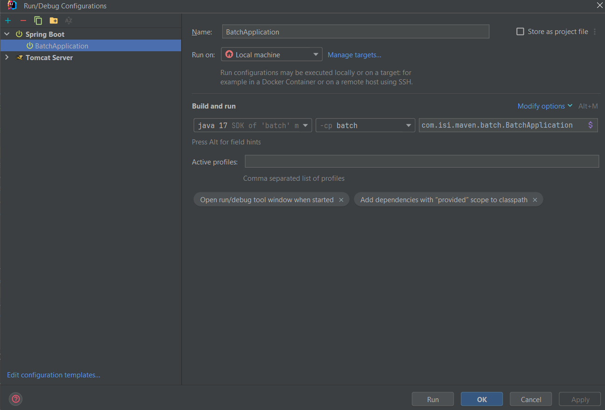
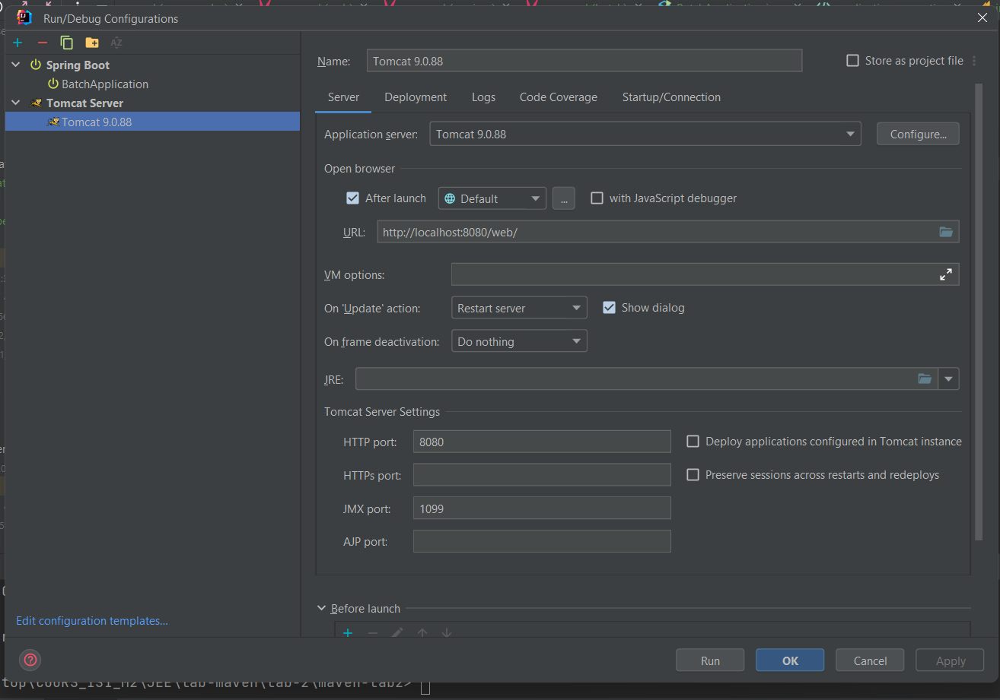
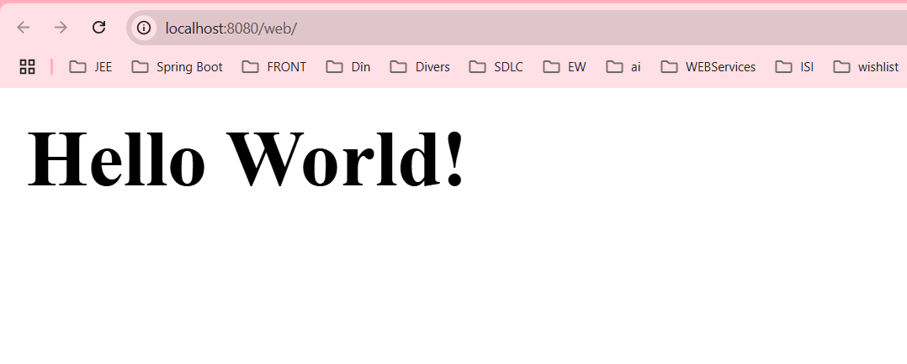

## TODO:
Créer un projet maven nommé commandes projet parent (maven) avec les modules maven suivants : 
- services (Gère le metier)
- web (Projet tomcat)
- batch (Projet spring boot)

### Environnement
- JDK 17
- Tomcat 9
- Maven 3.*

### Configuration

 

### Navigateur
 

